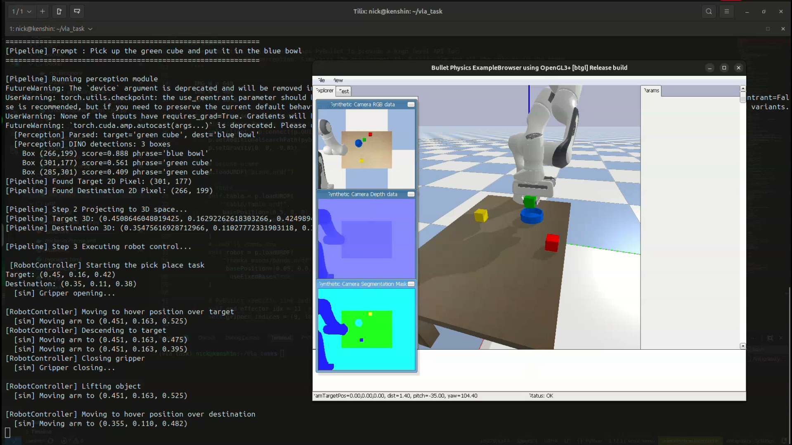
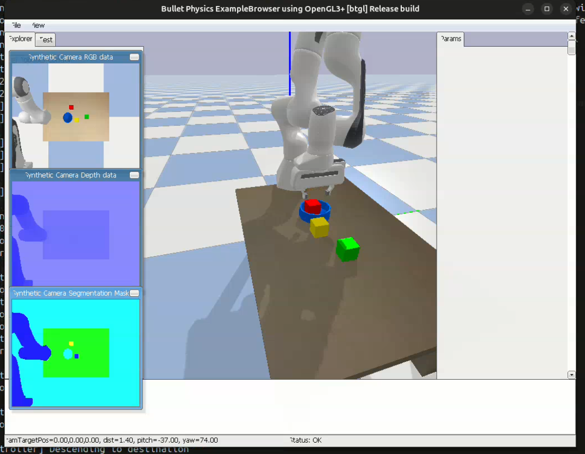

# Vision-Language-Action (VLA) Pick and Place Pipeline

A modular robotic pipeline that uses open-vocabulary object detection to perform physics-simulated pick-and-place tasks via natural language commands. The system utilizes GroundingDINO for text-prompted visual perception, PyBullet for robot simulation (Franka Panda arm), and precise coordinate projection to map 2D bounding boxes seamlessly into 3D world space for Inverse Kinematics (IK) grasp execution.

## Key Features
- **Natural Language Parsing**: Identify source and destination objects from an input prompt (e.g., `"Pick up the red cube and place it in the blue bowl"`).
- **Open-Vocabulary Perception**: Powered by GroundingDINO processing RGB images to detect target objects.
- **Physical Simulation**: Realistic environment built with PyBullet featuring a 7-DOF Franka Panda arm.
- **2D-to-3D Projection**: Utilizes depth camera parameters and intrinsics to project pixel coordinates natively into PyBullet 3D space.
- **Custom Object Support**: Includes customized URDFs (like an octagonal hollow bowl) and randomized, collision-aware object spawning.
- **Containerized for Reproducibility**: Includes a fully-managed Docker setup utilizing NVIDIA GPUs with robust X11 window forwarding for real-time GUI visualization.

---

# Installation & Setup

## Prerequisites

- **Operating System:** Linux (Ubuntu 22.04+ recommended)  
  > Note: Windows users should use WSL2 or the provided Docker configuration.

- **Hardware:** NVIDIA GPU (Minimum 4GB VRAM) with CUDA 12.1+ drivers

- **Package Manager:** uv (High-performance Python bundler)
- **Docker Engine:** (https://docs.docker.com/engine/install/)
- **NVIDIA Container Toolkit:** (https://docs.nvidia.com/datacenter/cloud-native/container-toolkit/latest/install-guide.html) (for GPU acceleration)

---

## Option A: Local Development (Linux/WSL2/On Host)

```bash

curl -LsSf https://astral.sh/uv/install.sh | sh
source $HOME/.cargo/env

git clone https://github.com/N1CKX-MU/Vision-Language-Action-Implementation.git
cd Vision-Language-Action-Implementation

curl -fsSL https://ollama.ai/install.sh | sh
ollama pull qwen2.5:0.5b

uv python install 3.12
uv sync --python 3.12

#  Install Grounding DINO (Requires CUDA C++ compilation)
uv pip install --no-build-isolation \
  "groundingdino @ git+https://github.com/IDEA-Research/GroundingDINO.git@856dde20aee659246248e20734ef9ba5214f5e44"

#  Download Pre-trained Weights
mkdir -p models/grounding_dino
wget -P models/grounding_dino/ https://github.com/IDEA-Research/GroundingDINO/releases/download/v0.1.0-alpha/groundingdino_swint_ogc.pth
wget -P models/grounding_dino/ https://raw.githubusercontent.com/IDEA-Research/GroundingDINO/main/groundingdino/config/GroundingDINO_SwinT_OGC.py

#  Execute Task
uv run python run.py --prompt "Pick up the red cube and place it in the blue bowl"

```

##  Option B: Docker (All-in-One Container)
### Ollama and the LLM weights are pre-configured inside the image.

Prerequisites: Docker, NVIDIA Container Toolkit.

```Bash

git clone https://github.com/N1CKX-MU/Vision-Language-Action-Implementation.git
cd Vision-Language-Action-Implementation

# Download model weights (Volume-mounted for speed)
mkdir -p models/grounding_dino
wget -O models/grounding_dino/groundingdino_swint_ogc.pth \
  "[https://github.com/IDEA-Research/GroundingDINO/releases/download/v0.1.0-alpha/groundingdino_swint_ogc.pth](https://github.com/IDEA-Research/GroundingDINO/releases/download/v0.1.0-alpha/groundingdino_swint_ogc.pth)"
wget -O models/grounding_dino/GroundingDINO_SwinT_OGC.py \
  "[https://raw.githubusercontent.com/IDEA-Research/GroundingDINO/main/groundingdino/config/GroundingDINO_SwinT_OGC.py](https://raw.githubusercontent.com/IDEA-Research/GroundingDINO/main/groundingdino/config/GroundingDINO_SwinT_OGC.py)"


xhost +local:docker

# Build the image
# This compiles CUDA operators and bakes Qwen 2.5 into the image (~15-20 min)
make build

# Execute the VLA Task
make run PROMPT="Pick up the red cube and place it in the blue bowl"

# Alternative: Open an interactive shell
make docker

```

## 📁 System Architecture & Structure
This pipeline emphasizes modularity.

* `run.py` - The main entry point initializing and launching the CLI sequence.
* `src/pipeline.py` - Core logic mapping the perception outputs to 3D projection, then directly to robot motion controllers.
* `src/perception.py` - Loads GroundingDINO and parses text bounding boxes.
* `src/projection.py` - Takes a 2D pixel `(u, v)`, reads the corresponding depth pixel, and applies `depth * inv(K)` to get the real-world 3D location constraint `(x, y, z)`.
* `src/robot_control.py` - Solves Inverse Kinematics recursively using PyBullet iteratively and commands the Panda joints using explicit positional force constraints.
* `starter_code/sim_env.py` - Sets up the ground plane, table, camera setup/intrinsics, randomly collision-spawns test items, and sets up IK configuration constraints.
* `urdf/` / `models/` / `Docker/` - Holds 3D mesh blueprints, local model configs, and the dedicated container logic.

---

---
## Execution Results:
```bash
Prompt-> Put the green Cube inside the blue bowl
```


```bash
Prompt-> Inside the blue bowl the red thing must go
```



## 🛠️ Modifying the Scene
To change the items spawned in the PyBullet simulation, modify the `colours` dictionary in `starter_code/sim_env.py` inside the `_spawn_objects` function:
```python
colours = {
    "red_cube":    ([1, 0, 0, 1],    "cube"),
    "blue_bowl":   ([0, 0.4, 1, 1],  "bowl"), # Uses urdf/bowl.urdf
    "green_cube":  ([0, 0.8, 0, 1],  "cube"),
    "yellow_cube": ([1, 0.9, 0, 1],  "cube"),
}
```
*Note: Due to robust procedural randomized area constraints, no matter how many items we add, they'll dynamically shift to avoid overlapping physics anomalies!*


## ⚠️ Troubleshooting & Ongoing Fixes
### Grounding DINO _C Extension Build Failure
    Symptoms: ImportError: cannot import name '_C' from 'groundingdino' or a massive wall of C++ errors during pip install.
    Cause: This occurs when the CUDA compiler (nvcc) isn't found or doesn't match the PyTorch version.
    The Fix: * Docker: Ensure you are using the nvidia/cuda:devel base image, not runtime.

    Local: Run export CUDA_HOME=/usr/local/cuda before installing.

    UV users: Use uv pip install --no-build-isolation to force the compiler to use the local environment's headers.

### Important Note on Docker:
The Docker environment is currently undergoing optimization. Due to the massive size of the VLA stack (CUDA + PyTorch + Grounding DINO + Ollama), some users may experience disk space exhaustion or extraction hangs during the build process( which it did for me).

## Recommendation:
Until the container image is slimmed down, please prefer Option A (Local UV Installation). The uv sync method is significantly faster, more stable, and is the primary way to ensure 100% hardware compatibility with your local GPU drivers.